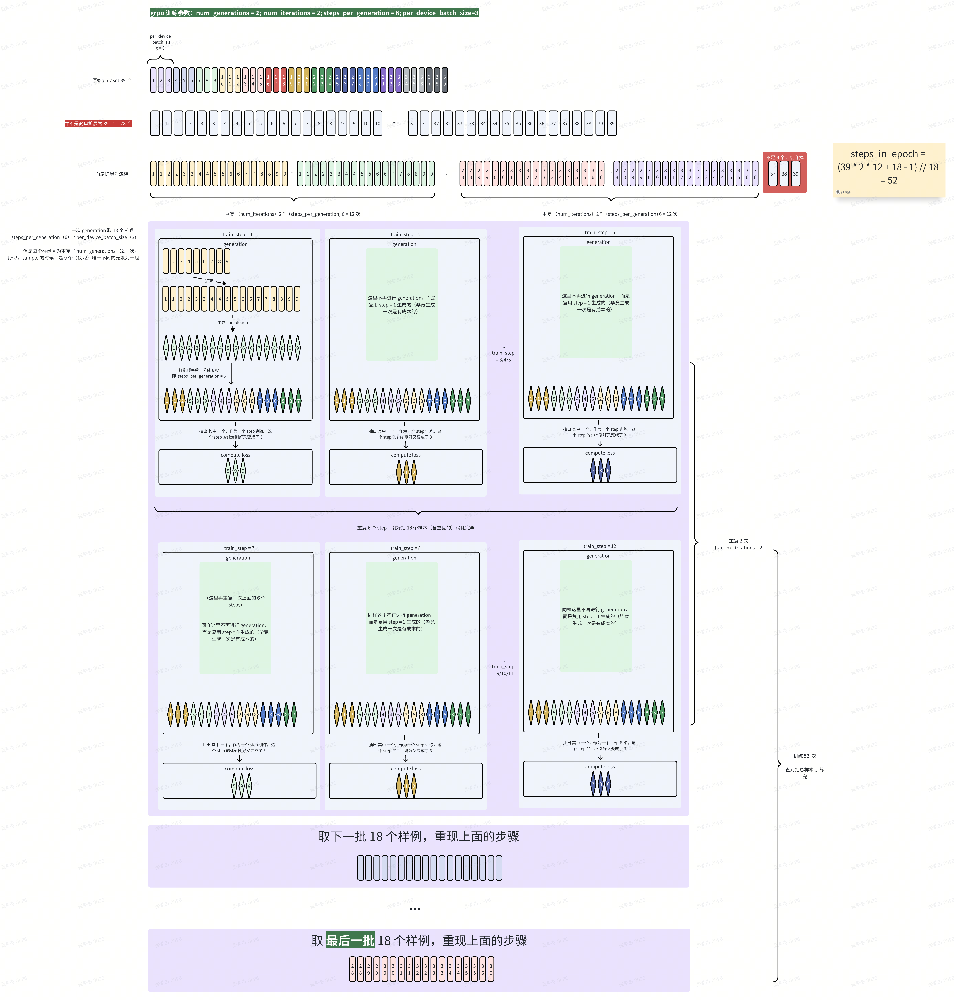

a pure grpo trainer for huggingface transformers models

# 理念
* 声明式训练，避免在代码逻辑中嵌入训练细节。

# 优势
* 专注 GRPO trainer，代码逻辑无其他兼容细节。
* 支持 dynamic num_iterations (即 动态迭代次数)，使得训练过程更加灵活和准确。

# 训练采样模式

# 限制
* only support pytorch
* only support huggingface transformers models
* only support fsdp/fsdp2; deepspeed not supported yet